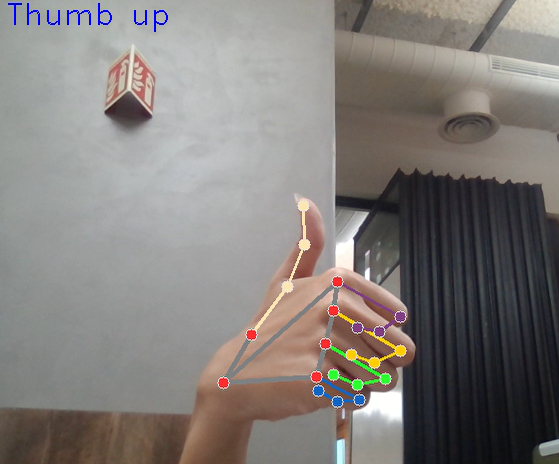
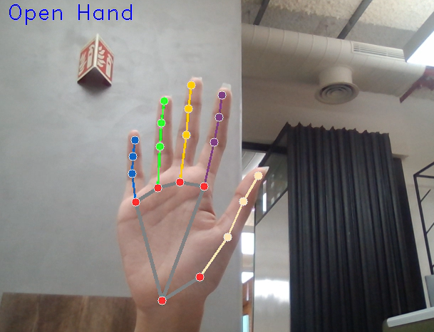
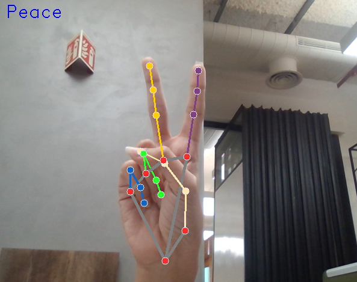

WaveNet – Real-Time Hand Gesture Recognition System
===================================================

WaveNet is a deep learning–based hand gesture recognition system that uses computer vision and neural networks to accurately detect and classify human hand gestures in real time. The project is designed for applications such as human–computer interaction, sign language interpretation, touchless control systems, and assistive technologies.

Features
--------

*   Real-time hand gesture detection using webcam/video input
    
*   CNN-based deep learning model for gesture classification
    
*   High accuracy with optimized preprocessing and feature extraction
    
*   Supports multiple hand gesture classes
    
*   Visual display of predicted gesture with confidence score
    
*   Scalable for adding new gestures easily
    

Tech Stack
----------

*   **Programming Language:** Python
    
*   **Deep Learning:** TensorFlow / Keras
    
*   **Computer Vision:** OpenCV, MediaPipe
    
*   **Model Type:** Convolutional Neural Network (CNN)
    
*   **Dataset:** Custom hand gesture image dataset
    

Recognized Gestures
-----------------------

Below are sample gestures recognized by the system:

### 👍 Thumbs Up


### 🖐️ Open Hand


### 👌 Ok


### ✌️ Peace


How It Works
---------------

1.  Captures live video frames from the camera
    
2.  Detects hand landmarks and regions of interest
    
3.  Preprocesses frames (grayscale, resize, normalization)
    
4.  Feeds data to trained CNN model
    
5.  Predicts the gesture class in real time
    
6.  Displays output on screen with bounding box and label
    

How to Run
----------

- Run ```python train.py``` to open the webcam. 
- Press and hold a number key (0–9) while showing a hand gesture to generate labeled training data. 
- Move your hand around to capture variations.
- Repeat for each gesture you want to include (e.g., Open hand → 0, Thumb Up → 1, OK → 2, Peace → 3).
- Next, use ```classify_gestures.ipynb``` in Jupyter Notebook to train a neural network with your collected data.
- By default, it supports 4 gesture classes, but you can adjust this if needed.
- Finally, test your model with ```detect_gesture.py```; the predicted gesture will appear in the top-left corner of the webcam feed.

Future Enhancements
-------------------

*   Add dynamic gesture recognition (gesture sequences)
    
*   Mobile app integration using Flutter
    
*   Sign language sentence generation
    
*   Edge deployment using TensorFlow Lite
    

Author
------------

**Lohitha Kayyuru**
